# TP3DPBO - Tugas Praktikum 3 DPBO

## ✊🏻 JANJI

Saya Faiz Muhammad Ghazali dengan NIM 2504531 mengerjakan Tugas Praktikum 3 dalam mata kuliah Desain Pemrograman Berorientasi Objek untuk keberkahan-Nya maka saya tidak akan melakukan kecurangan seperti yang telah di spesifikasikan. Aamiinn.

## 👾 DESKRIPSI PROGRAM

Program ini menerapkan konsep **inheritance**, **polymorphism**, dan **composition** dalam studi kasus **Sistem Bimbingan Skripsi** menggunakan pendekatan Pemrograman Berorientasi Objek (OOP).

Sistem memiliki beberapa kelas yang saling berhubungan:
1. **Manusia**: *Base class* yang menyimpan identitas dasar individu.
2. **Mahasiswa**: *Subclass* dari Manusia yang menambahkan informasi akademik mahasiswa.
3. **Dosen**: *Subclass* dari Manusia yang menambahkan informasi kepegawaian dan pengajaran dosen.
4. **BimbinganSkripsi**: *Composite class* yang menggabungkan objek Mahasiswa dan Dosen dalam suatu data bimbingan skripsi.

**Fitur & Ketentuan Utama:**
- Inisialisasi data awal mahasiswa dan dosen.
- Pembuatan objek bimbingan skripsi yang menghubungkan mahasiswa dengan dosen pembimbing.
- Menampilkan data bimbingan skripsi dalam bentuk kartu kontrol.
- Menampilkan informasi lengkap mahasiswa dan dosen melalui method `tampilkanProfil()`.
- Menambahkan data bimbingan skripsi baru ke dalam array of objects.
- Menampilkan daftar bimbingan terbaru setelah data berhasil ditambahkan.

## ❌ ERROR HANDLING

Program menggunakan pengecekan kapasitas array sebelum menambahkan data baru:
- **Validasi Kapasitas Data:** Program melakukan pengecekan terhadap `MAX_KAPASITAS` sebelum objek bimbingan baru dimasukkan ke dalam array.
- Jika kapasitas masih tersedia, data bimbingan baru akan ditambahkan.
- Jika kapasitas tidak mencukupi, data baru tidak dimasukkan ke dalam array.

## 📐 DIAGRAM KONSEP

Berikut merupakan diagram kelas yang merepresentasikan struktur OOP, pewarisan (*inheritance*), dan hubungan komposisi (*composition*) pada sistem **Bimbingan Skripsi**.

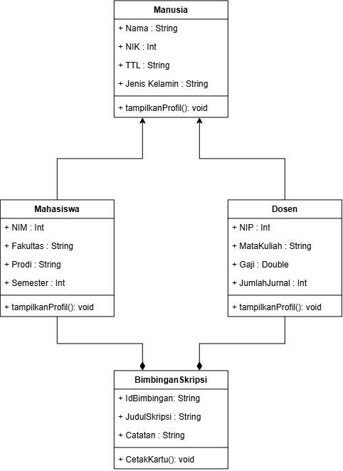

**Alasan Pemilihan Class:**
1. **Manusia:** Manusia merupakan class paling dasar yang merepresentasikan identitas umum individu. Atribut seperti `nama`, `nik`, `ttl`, dan `jenisKelamin` diletakkan di class ini karena digunakan oleh mahasiswa maupun dosen.
2. **Mahasiswa:** Mahasiswa merupakan turunan dari Manusia yang memiliki informasi khusus akademik seperti `nim`, `fakultas`, `prodi`, dan `semester`.
3. **Dosen:** Dosen merupakan turunan dari Manusia yang memiliki informasi khusus pengajar seperti `nip`, `mataKuliah`, dan `gaji`.
4. **BimbinganSkripsi:** BimbinganSkripsi digunakan untuk mengelola hubungan antara mahasiswa dan dosen pembimbing serta menyimpan informasi bimbingan seperti `idBimbingan`, `judulSkripsi`, dan `catatan`.

## ☕️ CLASS & ATRIBUT

1. **Manusia**
   - `nama` : string
   - `nik` : string
   - `ttl` : string
   - `jenisKelamin` : string

2. **Mahasiswa** *(extends Manusia)*
   - `nim` : string
   - `fakultas` : string
   - `prodi` : string
   - `semester` : int

3. **Dosen** *(extends Manusia)*
   - `nip` : string
   - `mataKuliah` : string
   - `gaji` : double

4. **BimbinganSkripsi** *(Composition)*
   - `idBimbingan` : string
   - `judulSkripsi` : string
   - `catatan` : string
   - `mhs` : Mahasiswa
   - `dsnPembimbing` : Dosen

## 🔗 KONSEP OOP YANG DIGUNAKAN

### 1. Inheritance

Sistem menerapkan **Hierarchical Inheritance**, yaitu satu class induk diturunkan menjadi lebih dari satu class anak.

- `Manusia` menjadi *Base Class*.
- `Mahasiswa` dan `Dosen` menjadi *Subclass* dari `Manusia`.
- Atribut dan method umum dari `Manusia` dapat digunakan kembali oleh `Mahasiswa` dan `Dosen`.

### 2. Polymorphism

Program menerapkan **method overriding** pada method `tampilkanProfil()`.

- `Manusia` memiliki method `tampilkanProfil()` sebagai method `virtual`.
- `Mahasiswa` melakukan *override* untuk menampilkan data manusia sekaligus data mahasiswa.
- `Dosen` melakukan *override* untuk menampilkan data manusia sekaligus data dosen.

### 3. Composition

Kelas `BimbinganSkripsi` menerapkan **Composition** dengan memiliki objek `Mahasiswa` dan `Dosen` sebagai bagian dari atributnya.

- `mhs` menyimpan objek Mahasiswa.
- `dsnPembimbing` menyimpan objek Dosen.
- Kedua objek tersebut menjadi bagian dari objek `BimbinganSkripsi`.

## 🍎 ALUR PROGRAM

1. Program membuat objek `Mahasiswa` dan `Dosen` dengan data identitas awal.
2. Program membuat objek `BimbinganSkripsi` dengan memasukkan objek mahasiswa dan dosen pembimbing.
3. Objek bimbingan dimasukkan ke dalam array `listBimbingan`.
4. Program memanggil fungsi `tampilkanSemuaData()` untuk menampilkan seluruh data bimbingan.
5. Fungsi tersebut melakukan iterasi terhadap array dan memanggil `cetakKartu()` pada setiap objek `BimbinganSkripsi`.
6. Program membuat objek mahasiswa baru dan menyiapkan data bimbingan baru.
7. Program memeriksa kapasitas maksimum array melalui `MAX_KAPASITAS`.
8. Jika kapasitas masih tersedia, data bimbingan baru dimasukkan ke dalam array.
9. Program kembali menampilkan daftar bimbingan untuk memastikan data baru berhasil ditambahkan.

## 📸 DOKUMENTASI PROGRAM

### Output Program C++

Berikut merupakan hasil eksekusi program C++ pada sistem **Bimbingan Skripsi**:
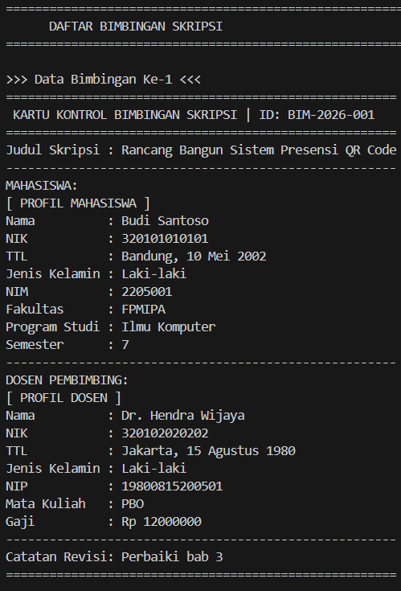
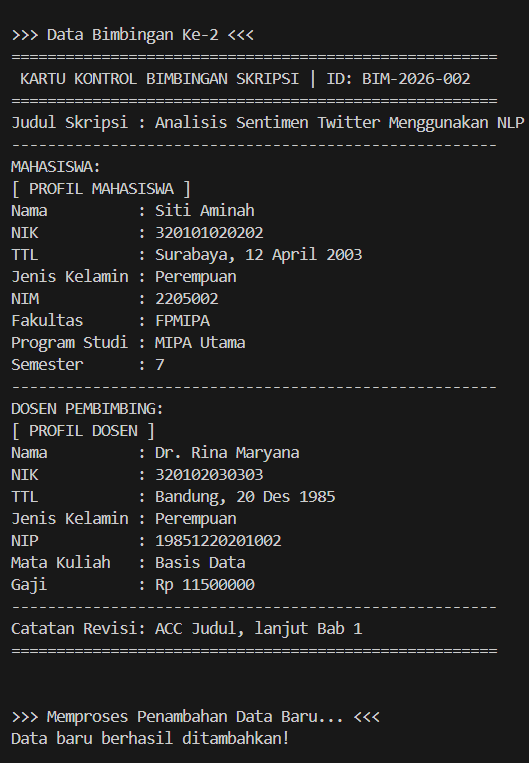
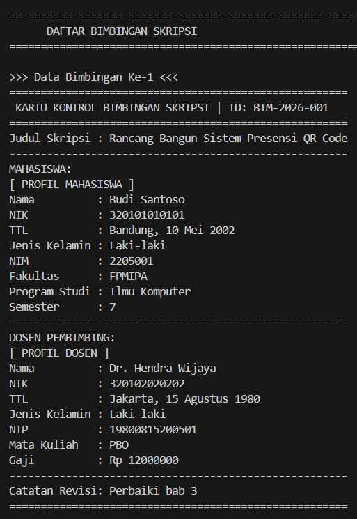
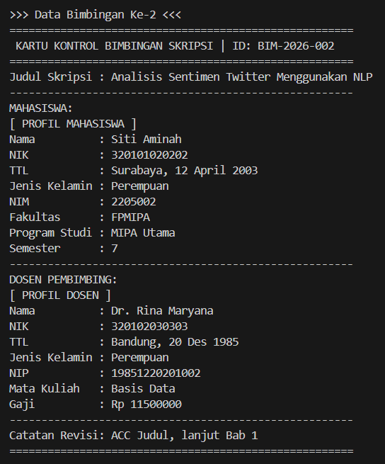
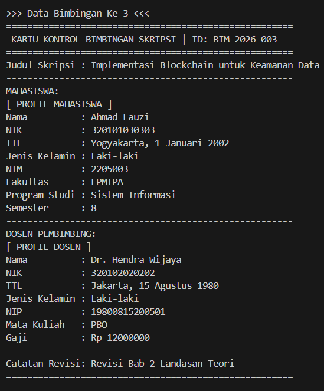
```

### Output Program Python

Berikut merupakan hasil eksekusi program Python pada sistem **Bimbingan Skripsi**:
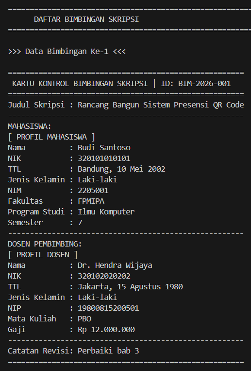
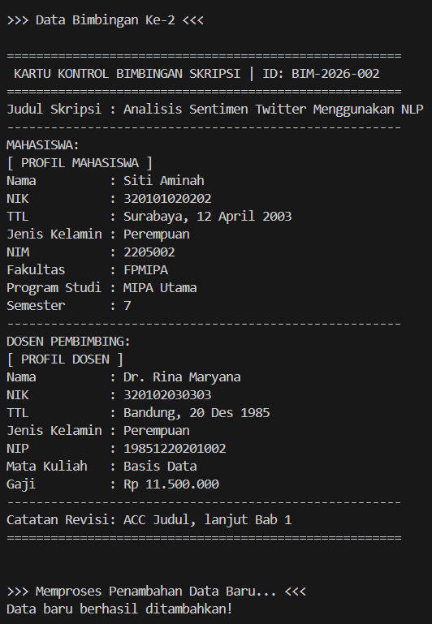
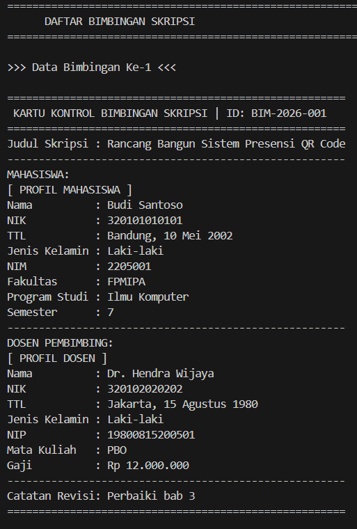
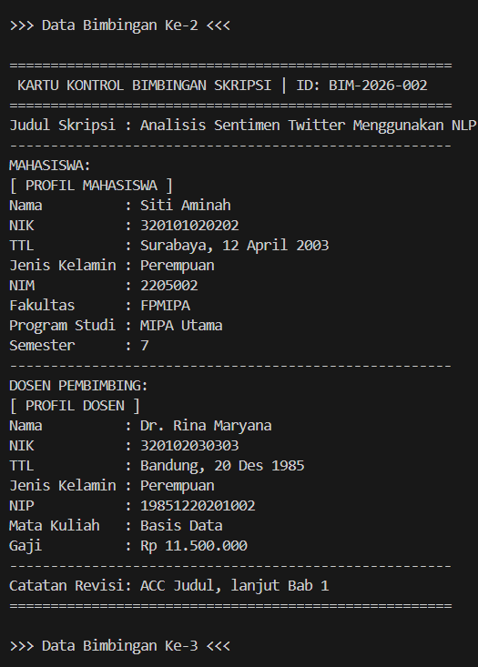
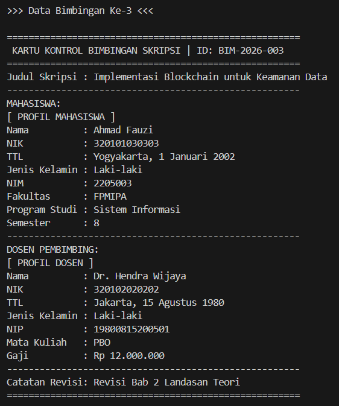

```
